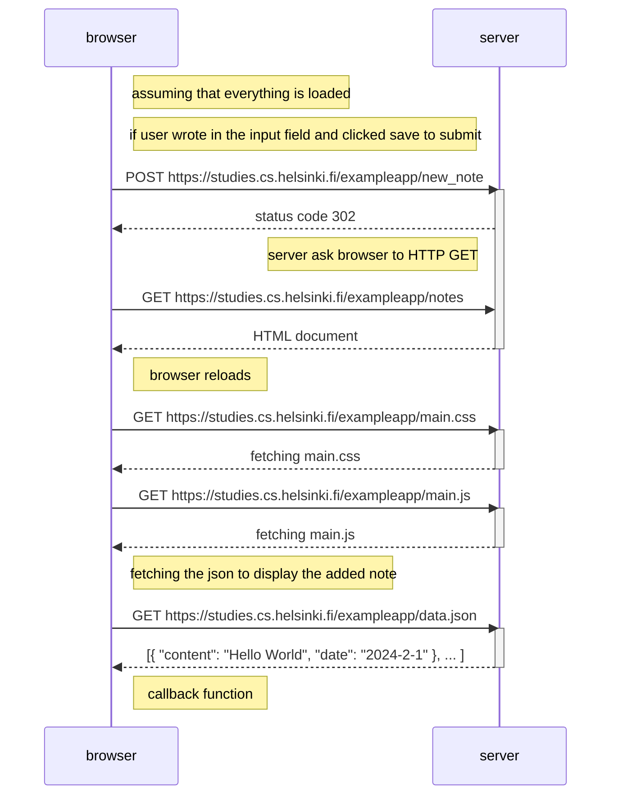

```mermaid
sequenceDiagram
    participant browser
    participant server
    
    Note right of browser: assuming that everything is loaded 
    
    Note right of browser: if user wrote in the input field and clicked save to submit
    browser->>server: POST https://studies.cs.helsinki.fi/exampleapp/new_note
    activate server
    server-->>browser: status code 302
    note left of server: server ask browser to HTTP GET
    browser->>server: GET https://studies.cs.helsinki.fi/exampleapp/notes
    server-->>browser: HTML document
    deactivate server

    Note right of browser: browser reloads 
    browser->>server: GET https://studies.cs.helsinki.fi/exampleapp/main.css
    activate server
    server-->>browser: fetching main.css
    deactivate server

    browser->>server: GET https://studies.cs.helsinki.fi/exampleapp/main.js
    activate server
    server-->>browser: fetching main.js
    deactivate server

    Note right of browser: fetching the json to display the added note 
    browser->>server: GET https://studies.cs.helsinki.fi/exampleapp/data.json
    activate server
    server-->>browser: [{ "content": "Hello World", "date": "2024-2-1" }, ... ]
    deactivate server

    Note right of browser: callback function
```
